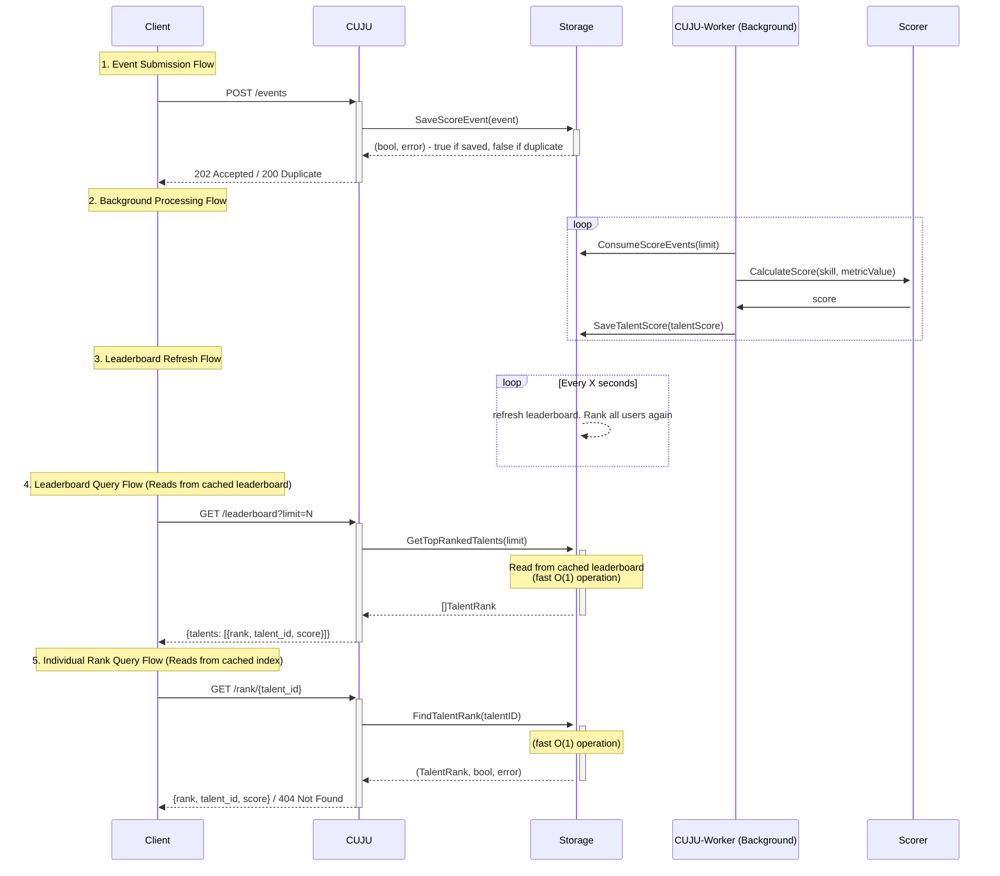

## Project Structure

All source files are located in the root directory for simplicity, as there is only a single implementation for each adapter (e.g., storage, scorer). The filenames are descriptive and indicate their respective responsibilities.

- I did Unit Testing only at the service level, only for main functionality because of ~2 hour scope.
- I used testify package for unit testing, though the code itself has no external dependencies as the task requires.
- I used integer for score and raw_metric fields for simplicity

**Getting Started:**  
Begin by reading `service.go` to familiarize yourself with the core domain models and service methods. This will provide a clear overview of the application's main logic and flow.


## Application Design




### System Flow Summary

We can imagine the system following a three-stage pipeline:

1. **Event Ingestion**: Score events are immediately stored using the outbox pattern, allowing fast client responses while ensuring durability
2. **Async Processing**: A background worker consumes events, calculates scores via the external scorer service, and persists talent scores
3. **Leaderboard Generation**: An in-memory goroutine periodically rebuilds the leaderboard from talent scores. This is basically similar to Materialized View approach.

### Design Decisions

**Time Constraints & Simplicity**
> Aim for 60–90 minutes; no external deps;

Skiplist would enable near real-time ranking updates, but time constraints and no-external package led to an eventual consistency model where the leaderboard is periodically recalculated and cached, as it is easier to implement.

**External Scoring Service**
Since Scoring is an external service, I tried to build a resilient solution against Scorer failures, by using outbox/queue pattern that provides:
  - Fast client responses (no blocking on external service)
  - Fault tolerance (events persist even if scorer fails)
  - Retry capability for failed scoring attempts
  - And also a nice log of all received Event Scores

## Data Model
The domain models are defined in `service.go`. The in-memory implementation in `inmem.go` uses these same models without requiring any new storage-specific models.

## Scaling Considerations for 30M Active Users

The in-memory solution cannot horizontally scale as the in-memory storage isn't shared between service replicas.

It's always about what the business wants, and to what extend can tech afford it. I would first ask following questions:
- **Rank Granularity**: Do users need exact ranks (1,723,638,182nd place) or saying "10.000+" is enough?
- **Update Frequency**: After user got a high score, should the rank changes be immediate or is eventual consistency acceptable?
- **Leaderboard Scope**: Do we have only 1 Single global leaderboard? or multiple ones? such as male/female. Can 1 user be in 1+ leaderboards? Then, 30M users could become 50M+ leaderboard entries.


Depending on this, I'd go for either real-time ranking using redis sorted, or Materialized View with Periodic Refresh to store the leaderboards(basically what I did but with database as an external dependency). But usually, redis always wins if it's about leaderboard application.

### Tradeoffs


**Real-time Ranking (Redis Sorted Sets)**
- Near-instant rank updates, and it can work well with millions of entries. 
- We will need to be build a solution to be resilient against complete redis failures. Maybe employ both solutions, and in case of redis failures, we use materizalied view while building the redis cache again.

**Materialized View with Periodic Refresh**
- More durable, easy to backup. We will serve stale data during refresh period. 


### Usage

1. **Start the server:**
   ```sh
   go run .
   ```

2. **(Optional) Make the test script executable:**
   ```sh
   chmod +x test.sh
   ```

3. **Run the test script to populate events and see sample API usage:**
   ```sh
   ./test.sh
   ```

The `test.sh` script sends 11 sample event requests for 6 different talents. It then uses the `/leaderboard`, `/rank/{talent_id}`, and `/metrics` endpoints to showcase their functionality and output.

### Non-functional checks:

- **Safe concurrent updates (multiple POST /events in parallel):**  
  The `POST /events` endpoint supports safe concurrent updates. Events are appended to storage using a thread-safe map, ensuring correctness even under parallel requests.

- **Basic performance: p95 read < 40ms locally:**  
  The leaderboard that storage builds and caches is the most optimal way it can be for our read patterns.

- **Minimal observability: /healthz + counters:**  
  I implemented 2 counters for processed events, dedup hits in the simplest way possible.

